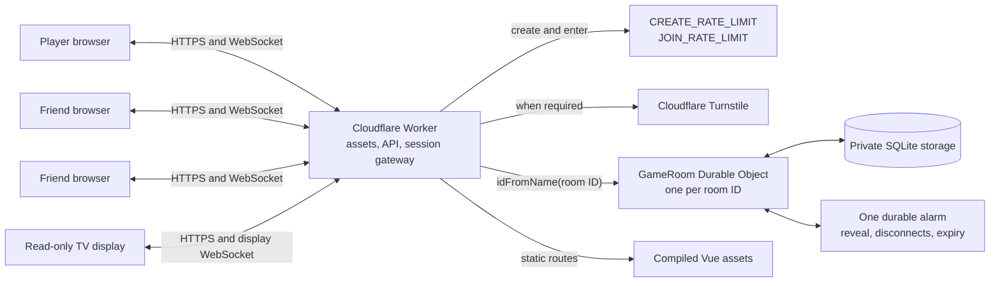
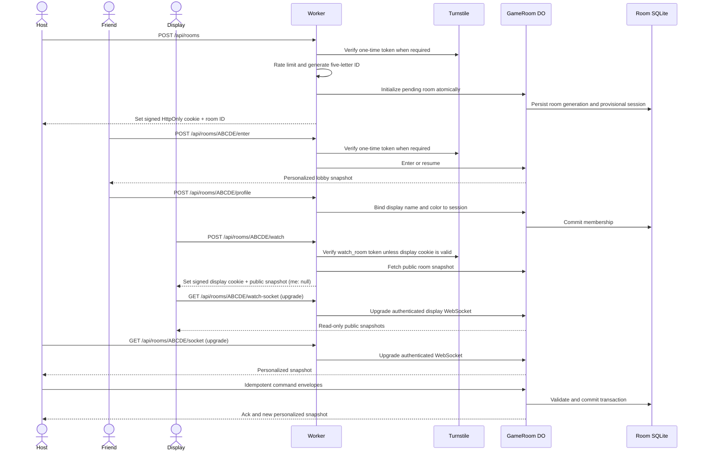

# Pain in My Deck architecture

## System shape

The application is a Vue 3, TypeScript, Vite, Vue Router, and Pinia single-page application served by the same Cloudflare Worker that owns its API. Every room maps deterministically to one SQLite-backed `GameRoom` Durable Object. That object is the only authority allowed to mutate room or game state.



Only `/api/*` runs Worker application code first. Other paths are asset-first and fall back to `index.html`, allowing Vue Router to handle `/join/:roomId` and `/tv/:roomId` without separate server routes.

There is deliberately no Supabase, Firebase runtime, D1, KV, R2, Queue, account service, analytics pipeline, or payment system.

## Room and request flow



### HTTP surface

| Method and path                       | Purpose                                                                                                                                                  |
| ------------------------------------- | -------------------------------------------------------------------------------------------------------------------------------------------------------- |
| `POST /api/rooms`                     | Accept `{ turnstileToken }`; create a pending room/provisional creator and return `{ roomId, redirectUrl }`.                                             |
| `POST /api/rooms/:roomId/enter`       | Accept `{ turnstileToken }`; resume or provision a session and return `{ snapshot, needsProfile }`.                                                      |
| `POST /api/rooms/:roomId/profile`     | Accept `{ displayName, colorSet }`; bind lobby membership and return `{ snapshot }`.                                                                     |
| `GET /api/rooms/:roomId/socket`       | Upgrade an authenticated room session to WebSocket.                                                                                                      |
| `POST /api/rooms/:roomId/watch`       | Apply the join limit and accept `{ turnstileToken }` when no valid display cookie exists; issue the cookie and return a public snapshot with `me: null`. |
| `GET /api/rooms/:roomId/watch-socket` | Upgrade an authenticated display session to a read-only WebSocket.                                                                                       |
| `GET /api/healthz`                    | Return `{ buildVersion, protocolVersion: 1 }` without touching a room.                                                                                   |

No endpoint lists rooms or exposes a hand or deck. `POST /watch` exchanges a live room ID for a room-scoped display credential and the public projection; the watch WebSocket requires that signed credential.

### Room IDs

Room IDs contain exactly five uppercase letters from `ABCDEFGHJKLMNPQRSTUVWXYZ` and match `^[A-HJ-NP-Z]{5}$`. This creates 7,962,624 possible codes without mixing letters and numbers.

The Worker uses Web Crypto to generate a candidate, derives the Durable Object with `GAME_ROOMS.idFromName(roomId)`, and asks it to initialize atomically. A collision retries with a new candidate, up to 20 attempts. Every initialization also creates a random room generation, so a session for a previously expired use of the same code cannot access a later room.

Codes are normalized with trim plus uppercase at every boundary. The short code is the only friend-facing access key, so “private” means unlisted, rate-limited, and challenge-protected rather than confidential. Anyone who obtains or guesses a live code and passes the gateway controls can request a display credential and see the public projection, including player names, scores, chat, and completed history. They still cannot see hands, deck order, or unrevealed authors, and a display credential grants no player capabilities. Rooms that need confidential chat require a stronger invitation model than five-letter codes.

## Sessions and trust boundaries

- The gateway issues `__Host-pid_session` with `Path=/`, `Secure`, `HttpOnly`, and `SameSite=Strict`; browser JavaScript cannot read it. Local HTTP development uses the runtime's development-safe equivalent, but remote environments must satisfy every `__Host-` cookie requirement.
- The watch flow issues a separate signed `__Host-pid_display` cookie with the same transport protections. Its display-only credential is never accepted as `__Host-pid_session`, cannot resume a player, and cannot authorize a player command.
- The signed envelope binds the opaque session identifier, room ID, and room generation. Signatures use HMAC-SHA-256 with `SESSION_SIGNING_KEY` and are verified before the Durable Object is accessed.
- The Durable Object stores a session hash and membership state, not the raw browser credential.
- Mutation and WebSocket requests validate their `Origin`.
- Newcomers may join only while the room is in the lobby. Existing valid sessions may reconnect later.
- Kicking or leaving revokes membership server-side. Starting a game closes new membership.
- The browser never decides whether a command is legal. The room validates the session, current phase, round, role, card ownership, settings, and payload.
- Turnstile validation is server-side and required for create, enter, and first-time watch access in staging and production. Watch uses the `watch_room` action; a valid returning `__Host-pid_display` cookie resumes without a new challenge. Tokens are short-lived and single-use; the secret exists only as a Worker secret.
- `VITE_TURNSTILE_SITE_KEY` is a public, environment-specific build variable embedded in the Vue bundle. Vite development falls back to Cloudflare's always-pass test site key only when this value is absent.
- `CREATE_RATE_LIMIT` permits 3 creation attempts per 60 seconds per gateway key. `JOIN_RATE_LIMIT` permits 20 entry or initial watch probes per 60 seconds. Valid room commands and chat also have room-local limits.

Five-letter IDs are intentionally easy to share and brute-forceable at sufficient scale. Rate limits and Turnstile reduce casual probing; they do not turn room chat into a secure messaging system.

## Read-only TV display

`/tv/:roomId` is the universal big-screen route. It obtains a signed display credential through `POST /api/rooms/:roomId/watch`, then receives live public snapshots from `GET /api/rooms/:roomId/watch-socket`. The display renders the room's join QR code, chat, leaderboard, and latest completed-round receipt without creating a player profile or occupying a seat.

The display surface is a projection, not a spectator player. Its snapshot always has `me: null`. Display connections never count toward connected-player requirements, change player presence, receive a hand, become host or Czar, create disconnect-grace work, or authorize mutations. Closing or reconnecting a display cannot alter game state.

The route works directly in a laptop or TV browser. Native Google Cast integration is a separate future sender/receiver layer described in `docs/CAST.md`; it is not part of the current implementation.

## WebSocket protocol and projections

The browser sends a flat, versioned command envelope:

```ts
type ClientCommand = {
  protocolVersion: 1;
  commandId: string;
  type: string;
  roundId?: string;
  payload: unknown;
};
```

Authenticated player sockets support these command types:

- `update_settings`
- `start_game`
- `submit_card`
- `submit_blank`
- `redraw_card`
- `choose_winner`
- `send_chat`
- `kick_player`
- `leave_room`
- `request_snapshot`
- `process_due`

The room returns acknowledgement, typed error, and snapshot frames. Every snapshot envelope includes `protocolVersion: 1`, a monotonically increasing `revision`, and `serverTime`, followed by the shared room projection and connection-specific `me` projection. An incompatible client is rejected and must reload. A reconnect receives a complete snapshot rather than replaying an event stream.

Commands are idempotent. The room records the command identifier, request digest, and prior result; repeating the same command can return the prior result, while reusing an identifier with different input is rejected. Mutations, revision increments, and idempotency records commit together before any broadcast.

Snapshots are serialized per connection:

- shared state includes phase, settings, players, scores, question, submission progress, chat, and completed history;
- `me` includes only the receiving player’s hand, redraw usage, identity, and privileges;
- display connections receive the same public snapshot shape with `me: null`;
- other hands and deck order are never sent;
- played-card authors are withheld during judging and appear only after reveal.

Display WebSockets receive public broadcasts but are excluded from membership and presence accounting. They never authorize the player command protocol or trigger room mutations.

The client keeps the highest room revision it has seen and discards older snapshots. Lost sockets reconnect with bounded backoff and retry unacknowledged command envelopes using the same command IDs.

## Game lifecycle

The public snapshot exposes `LOBBY`, `PLAYING`, and `FINISHED`. While playing, the turn status and winner field distinguish collection, judging, and reveal.

```mermaid
stateDiagram-v2
    [*] --> LOBBY
    LOBBY --> COLLECTING: Host starts with 3–8 connected players
    COLLECTING --> JUDGING: Every non-Czar submits
    JUDGING --> REVEAL: Czar chooses a winner
    REVEAL --> COLLECTING: Four-second reveal job runs
    REVEAL --> FINISHED: Winning score reached

    COLLECTING --> COLLECTING: Departure restarts round; at least 3 remain
    JUDGING --> COLLECTING: Departure restarts round; at least 3 remain
    COLLECTING --> FINISHED: Fewer than 3 remain
    JUDGING --> FINISHED: Fewer than 3 remain
    REVEAL --> FINISHED: Fewer than 3 remain
```



The first joined player is the first Czar, then Czar duty follows join order. The server shuffles submissions once before judging and reveals authors only after selection. A win adds one point.

The lobby chooses one of three server-owned hand policies: replenish only the played cards (the default), replace every active hand whenever a round restarts, or replace hands after a full active-Czar rotation. A rotation completes when the next Czar's immutable join order wraps to a value less than or equal to the outgoing Czar's order. Departures are applied before that lookup, so the remaining active cycle defines the boundary; restarting with the same Czar is not a rotation transition. Reconnects only restore the persisted snapshot and never deal cards.

An unexpected disconnect creates a 90-second grace job. Reconnecting with the valid session restores the same player and hand. If grace expires, the room removes the player, transfers host privilege to the longest-tenured remaining member, and either restarts the round or finishes as cancelled when fewer than three players remain. Explicit leave applies the same transition immediately.

## Durable Object persistence

Each `GameRoom` uses its own strongly consistent SQLite database for:

- room metadata, generation, settings, phase, revision, and expiration;
- provisional and member sessions;
- players, host/Czar order, presence, and scores;
- immutable card instances, hands, deck/discard state, and plays;
- chat messages and completed-round history;
- scheduled jobs; and
- the processed-command idempotency ledger.

Application schema versions live in `_sql_schema_migrations`. Initialization migrations are idempotent and additive. Durable Object class migration `v1` creates the SQLite-backed `GameRoom` namespace; a destructive or incompatible future format must use a new class/namespace or wait for the 24-hour room lifetime to drain.

SQLite constraints enforce uniqueness such as one submission per player per round and one processed command identity. A command processes overdue jobs, validates, mutates, writes its idempotency result, and increments the room revision in one transaction. No network I/O happens inside the mutation transaction.

Cloudflare permits one alarm per Durable Object. A persisted jobs table therefore multiplexes four-second reveal deadlines, 90-second disconnect grace, five-minute unclaimed-room expiry, and 24-hour inactivity expiry. The alarm processes every due job idempotently and schedules the next earliest deadline. Incoming requests and socket messages also process overdue work; a browser can wake the room but cannot choose the transition.

The room accepts sockets with the Durable Object hibernation API. Compact socket attachments preserve the session association across hibernation, while all authoritative data remains in SQLite. No correctness depends on an in-memory timer or object field surviving eviction.

## Cards

`cards/base.json` is a pinned, server-owned catalog exported from the legacy Firestore `CAH_BASE` deck. It contains 458 answers and 76 questions, stable legacy IDs, exact text, five classification flags, source/version metadata, and a fixed SHA-256 digest.

Family mode excludes stock cards marked `obscene`, `offensive`, or `sex`; it does not filter the `language` or `politics` flags. The catalog test locks the full counts, safe counts, flag totals, unique IDs, single-answer questions, and digest.

Card text is licensed under `CC-BY-NC-SA-2.0`; see `LICENSE-CARDS.md`. The application must remain noncommercial unless its card-content rights are replaced or separately cleared.

## Bindings and environments

| Name                      | Kind                     | Responsibility                                         |
| ------------------------- | ------------------------ | ------------------------------------------------------ |
| `ASSETS`                  | Worker assets            | Compiled Vue application and SPA fallback              |
| `GAME_ROOMS`              | Durable Object namespace | One SQLite `GameRoom` per normalized room ID           |
| `CREATE_RATE_LIMIT`       | Rate-limit binding       | Room creation gateway limit                            |
| `JOIN_RATE_LIMIT`         | Rate-limit binding       | Room entry/probe gateway limit                         |
| `ENVIRONMENT`             | Plaintext variable       | `development`, `staging`, or `production` behavior     |
| `TURNSTILE_REQUIRED`      | Plaintext variable       | Disables local verification and requires it remotely   |
| `SESSION_SIGNING_KEY`     | Secret                   | HMAC session signing; unique per environment           |
| `TURNSTILE_SECRET_KEY`    | Secret                   | Server-side Turnstile siteverify credential            |
| `VITE_TURNSTILE_SITE_KEY` | Vite build variable      | Public widget key; distinct for staging and production |

Local, staging, and production use Worker names `paininmydeck-local`, `paininmydeck-staging`, and `paininmydeck`. The two remote environments have distinct Durable Object and rate-limit namespaces and must use distinct secrets. Both deploy to `workers.dev`; no custom domain is part of the initial release.

Static assets are served without invoking game routing. Only `/api/*` is configured as Worker-first. Observability is enabled, but logs must contain only correlation identifiers and error categories—not cookies, Turnstile tokens, hands, card text, chat text, or full command payloads.

## Testing and deployment

The repository separates browser/domain tests from Worker integration tests:

- `npm test` — catalog and client/domain unit tests;
- `npm run test:worker` — Worker and Durable Object tests with Cloudflare’s Vitest pool;
- `npm run test:e2e` — Chromium multiplayer and visual-regression flows;
- `npm run cf:startup` — Worker startup validation;
- `npm run deploy:dry-run` — production bundle and migration validation without deployment.

CI also runs formatting, lint, generated-binding-type checks, TypeScript checks, and the production build. Staging must complete a full three-player and eight-player rehearsal before production is deployed.

Wrangler deployment applies Durable Object class migrations; those migrations are not rolled back by rolling back Worker code. Keep application schema migrations additive. For an application-only regression, list deployed versions and use Wrangler rollback only when the prior Worker remains compatible with the current SQLite schema.

The release and Firebase retirement procedure is in `docs/CUTOVER.md`. TV mode and the future Google Cast path are documented in `docs/CAST.md`.
